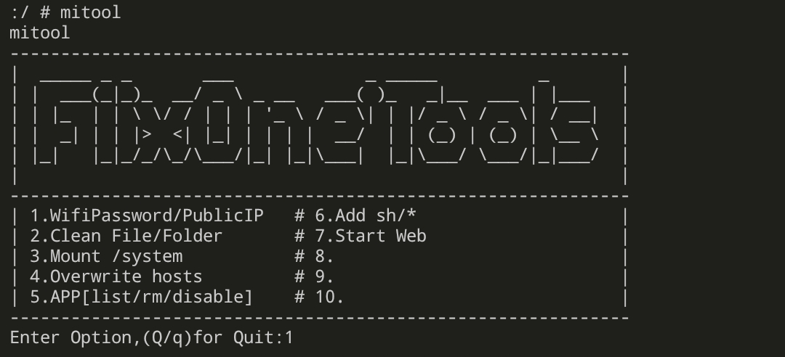
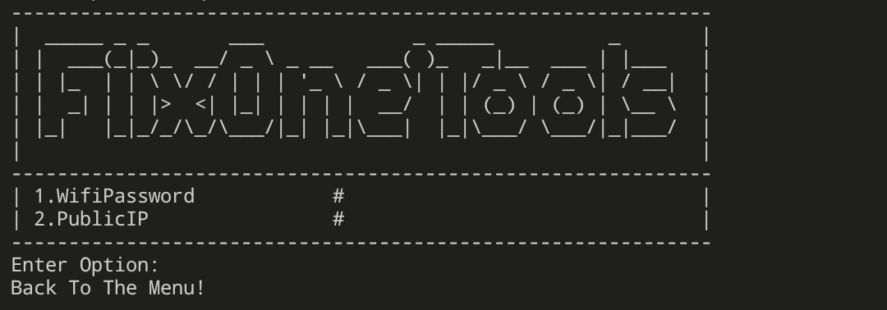
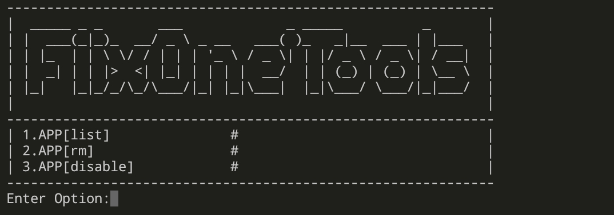

# Mitool 准备和安装

## 一. 前言

1. 本人严重讨厌通知栏广告，权限滥用。
2. 每次系统更新看见有想用的功能了很是头疼，更新后部分软件重新预装。单个卸载删除太麻烦。
3. 部分应用临时用不上，批量冻结。
4. 登录过的WiFi给忘了密码，扫码什么的太麻烦。
5. 需要设置Hosts,禁广告。
6. 批量删除根目录广告、空文件夹。

**纯脚本,需开启Root.自定义食用效果更佳**


---
## 二. 前期准备(必须):
> 部分功能个人定义的，需要用到BusyBox

* 开发版用户-设置-授权管理-Root权限管理，开启Root权限。(每次升级完同样步骤)

* 手机开启USB调试，电脑端运行ADB(解锁system分区)

```
adb root
adb disable-verity
adb reboot now

```

* **下载[Releases](https://github.com/fiixone/mitool/releases)** 文件，解压后将 **su** 文件夹 **放在内部存储根目录** 。

---
## 三. 安装

> 使用手机终端控制台:
>
> Android 10以后system无法有效挂载读写模式,在此创建`/data/bin/`,后期加入`PATH`即可运行

```shell
# 切换到 root
su
# 
mkdir /data/bin
cp /sdcard/su/mitool /data/bin/

chmod +x /data/bin/mitool

```

至此，工具安装完成。

运行请输入`/data/bin/mitool`或者添加`export PATH=$PATH:/data/bin/`后直接`mitool`

即可进入工具(**可添加为代码片段或者短语，使用更方便**)

## 三. 基本目录解析


|文件/文件夹名称|说明|
|---|---|
|mitool|主脚本|
|backup|卸载应用时将移动到此文件夹|
|web|简单的web server根目录|
|sh|批量拷贝可执行脚本的目录|
|app-all.list|读取系统安装的所有包|
|app-disable.list|需要禁用的包名|
|app-remove.list|需要卸载的包名|
|dir-clean.list|需要批量清理的文件夹名|
|hosts|自定义Hosts文件，我提供的里面禁止了部分广告|
|wifi.pw|WiFi帐号密码导出文件|


***切记运行前注意查看上面的配置文件，避免误删！！！***


(里面有的数据是我卸载的包名)

## 四. 脚本图示

在模拟终端里面**su**使用Root权限。

运行`mitool`

根据**数字选择需要**的功能即可。








***切记运行前注意修改上面的配置文件！！！***

